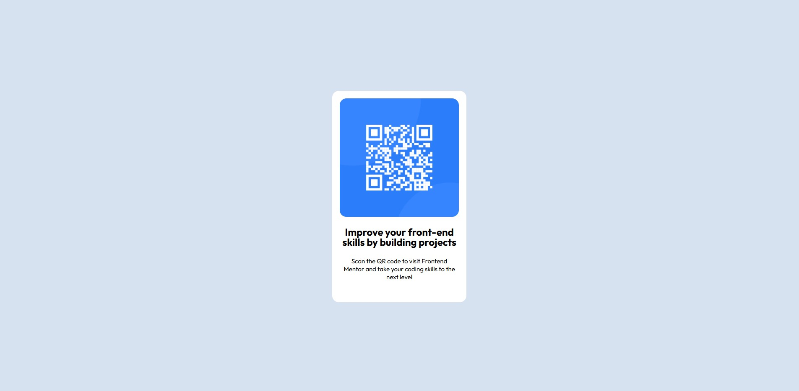

# Frontend Mentor - QR code component solution

This is a solution to the [QR code component challenge on Frontend Mentor](https://www.frontendmentor.io/challenges/qr-code-component-iux_sIO_H). Frontend Mentor challenges help you improve your coding skills by building realistic projects. 
Side note: I plan to make a react version for this. But for now this runs through VS Code live server.

## Table of contents

- [Overview](#overview)
  - [Challenge] (#challenge)
  - [Screenshot](#screenshot)
  - [Links](#links)
- [My process](#my-process)
  - [Built with](#built-with)
  - [What I learned](#what-i-learned)
  - [Continued development](#continued-development)
  - [Useful resources](#useful-resources)
- [Author](#author)

**Note: Delete this note and update the table of contents based on what sections you keep.**

## Overview
### Challenge
- Frontmentor Challenge (https://www.frontendmentor.io/challenges/qr-code-component-iux_sIO_H)

### Screenshot

### Links

- Solution URL: [Add solution URL here](https://your-solution-url.com)
- Live Site URL: [Add live site URL here](https://your-live-site-url.com)

## My process
- Added main styling in the root
- HTML markup
- Finished with design and responsiveness

### Built with

- Semantic HTML5 markup
- CSS custom properties
- Flexbox
- Mobile-first workflow

## Author

- Frontend Mentor - [@JhonD1](https://www.frontendmentor.io/profile/JhonD1)
- Github - [@JhonD1](https://github.com/JhonD1)

